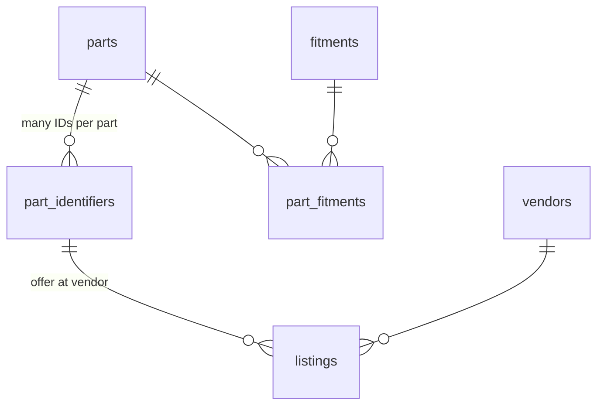
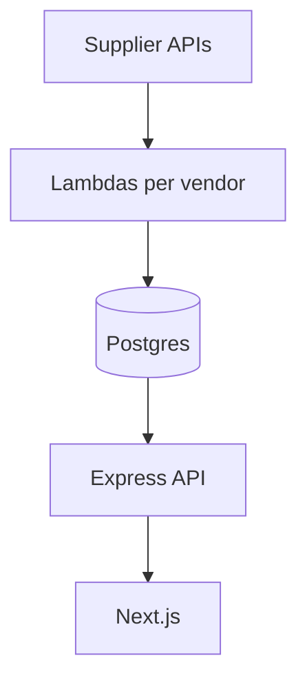
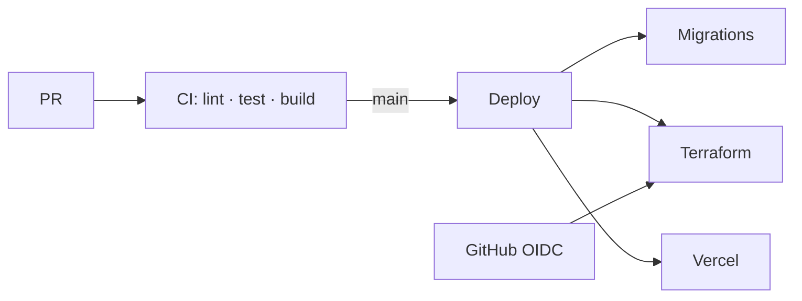

# Boneyard

**Multi-vendor collision parts search** — VIN/fitment, part number, filters, side-by-side compare. Built and deployed end-to-end.

| | |
|---|---|
| **Live** | [getboneyard.com](https://getboneyard.com) |
| **Stack** | TypeScript · Next.js · Express · Postgres · AWS Lambda · Vercel · Terraform |
| **Shipped with tests** | **138** automated tests (PGlite in CI, no hosted DB for unit runs) · live smoke on `main` · OIDC deploy, no long-lived AWS keys |

<!-- Add: your name · email · LinkedIn · 1–2 screenshots -->

---

## What I built

Scheduled workers ingest supplier catalogs into **one normalized database**; the app searches across vendors in a single UI.

- **Vendor plugin model** — `VendorInventoryClient` + shared pipeline; eBay US/CA live, LKQ stubbed. New vendor ≈ mapper + config, not a second worker codebase.
- **Resumable ingestion** — Paged catalogs, cursor checkpointing, one concurrent Lambda per vendor (12 min budget).
- **MVP scope** — Search/compare shipped; checkout/Stripe in `src/ordering/`, API routes not enabled yet.

---

## Data model & ingestion

**Problem:** One physical part can have an OEM number, aftermarket SKU, and interchange ID — formatted differently per vendor (`1234-AB` vs `1234AB`). Shops should search once and see **all equivalent listings**.



| Table | Purpose |
|-------|---------|
| `parts` | Canonical part (name + category) |
| `part_identifiers` | OEM / aftermarket / interchange — normalized for lookup |
| `fitments` + `part_fitments` | Vehicle fit |
| `listings` | Vendor price, condition, stock, URL for a specific identifier |

**Ingestion (`DrizzleRecordProcessor`):** normalize → **2 bulk reads** per 200-listing page → classify in memory (new / update / conflict) → **1 transaction** with batched fitments + `part_fitments` → optional fitment enrichment **only for new parts**.

> **~140× fewer DB round-trips per page** — naïve row-by-row ingest ≈ **3,500** SQL ops vs **~25** with batching (typical 200-listing page). Fitment-heavy paths go from **tens of thousands** of serial INSERTs to **a handful** of chunked statements — the difference between **timing out** a 12 min Lambda and **finishing** a catalog page.

Tests lock this in: idempotent re-ingest, conflict detection when IDs map to two parts, and **graph-integrity checks** so ingestion cannot leave orphan rows ([`recordProcessor.test.ts`](src/vendors/recordProcessor/recordProcessor.test.ts)).

Code: [`src/db/models/`](src/db/models/) · [`src/vendors/recordProcessor/recordProcessor.ts`](src/vendors/recordProcessor/recordProcessor.ts)

---

## Architecture





- **Search API:** fitment + part-number queries; `DISTINCT ON` so multi-trim joins do not duplicate listings ([`listings.ts`](apps/api/routes/listings.ts)).
- **Deploy:** runs only after CI passes; **path filters** skip unchanged services (client vs API vs workers).
- **Ops:** [BOOTSTRAP.md](./BOOTSTRAP.md)

---

## Start here

| Folder | Why open it |
|--------|-------------|
| [`src/vendors/`](src/vendors/) | Plugin interface, pipeline, batch ingest |
| [`apps/api/routes/listings.ts`](apps/api/routes/listings.ts) | Search + pagination |
| [`apps/client/`](apps/client/) | Fitment wizard, results, compare |

---

## Run locally

Node 20 · `DATABASE_URL` · vendor API keys (eBay today — [BOOTSTRAP.md](./BOOTSTRAP.md))

```bash
npm ci && npm run setup && npm run dev   # client :3000 · API :5050
npm test
```
